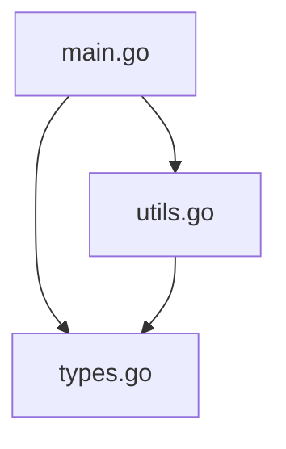

# AGENTS.md - LLM Integration Guide

This document provides guidance for LLM agents working with Code4Context and interpreting its output.

## Tool Purpose

Code4Context generates structured summaries of codebases specifically designed for LLM consumption. The output (`codebrev.md`) provides a hierarchical view of code structure that helps AI assistants understand:

- Available functions and their signatures
- Type definitions and relationships  
- Variable scope and organization
- File-by-file code organization

## Output Format

### Structure Overview
```markdown
# Code Structure Outline

## [filename]
### Functions
- functionName(param1 type, param2 type) -> returnType

### Types  
- TypeName (methods: method1, method2) (fields: field1, field2)

### Variables
- variableName
```

### Language-Specific Parsing

**Go Files (.go)**
- Full AST parsing with complete type information
- Accurate parameter types and return values
- Struct fields and method receivers
- Package-level variables and constants

**JavaScript/TypeScript (.js, .jsx, .ts, .tsx)**
- Regex-based parsing for rapid analysis
- Function declarations and arrow functions
- Class definitions with methods and properties
- Import/export statements tracked as special types
- TypeScript type annotations preserved

## Best Practices for LLM Agents

### 1. Context Understanding
- Use `codebrev.md` as a map before diving into specific files
- Identify relevant functions/types before requesting file contents
- Understand the overall architecture from the file structure

### 2. Efficient Code Navigation
- Reference functions by `filename:functionName` format
- Look for related functionality in the same file first
- Check type definitions to understand data structures

### 3. Code Modification Guidance
- Verify function signatures before suggesting changes
- Understand existing patterns from the outline
- Consider impact on related functions/types

### 4. Smart Filtering Applied
The tool automatically filters out:
- Test files (`*_test.go`, `*.test.js`, `*.spec.js`)
- Temporary variables (`i`, `j`, `tmp`, `temp`, etc.)
- Common noise patterns
- Duplicate declarations

## Integration Patterns

### For Code Analysis
1. Generate `codebrev.md` first
2. Identify relevant sections
3. Request specific file contents
4. Cross-reference with outline for context

### For Code Generation
1. Review existing patterns in outline
2. Identify similar functions/types
3. Follow established conventions
4. Regenerate outline to verify additions

### For Debugging
1. Locate function in outline
2. Check parameter types and return values
3. Identify related functions in same file
4. Trace dependencies through type usage

## Future Enhancements

### Planned Features
- **Mermaid Diagrams**: Visual representation of file dependencies
- **Call Graphs**: Function usage and relationship mapping
- **Import Analysis**: Cross-file dependency tracking
- **Module Visualization**: Package/namespace organization

### Expected Output Evolution
```markdown
## Dependency Graph


## Tips for Effective Usage

1. **Always check the outline first** before making assumptions about available functions
2. **Use type information** to understand data flow and relationships
3. **Pay attention to file organization** - related functionality is often grouped
4. **Consider the filtered output** - if something seems missing, it may have been filtered as noise
5. **Regenerate after changes** to keep the outline current

## Common Use Cases

- **Codebase exploration**: Understanding unfamiliar projects
- **Refactoring guidance**: Identifying affected functions and types  
- **API discovery**: Finding available functions and their signatures
- **Architecture analysis**: Understanding code organization and patterns
- **Documentation generation**: Using structure for automated docs

This tool bridges the gap between raw code and LLM understanding, providing the structured context needed for effective AI-assisted development.