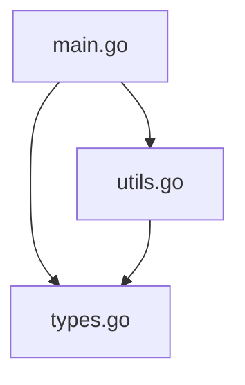

# AGENTS.md - LLM Integration Guide

This document provides guidance for LLM agents working with Code4Context and interpreting its output.

## Tool Purpose

Code4Context generates structured summaries of codebases specifically designed for LLM consumption. The output (`codebrev.md`) provides a hierarchical view of code structure that helps AI assistants understand:

- Available functions and their signatures
- Type definitions and relationships  
- Variable scope and organization
- File-by-file code organization

## Output Format

### Structure Overview
```markdown
# Code Structure Outline

## [filename]
### Functions
- functionName(param1 type, param2 type) -> returnType

### Types  
- TypeName (methods: method1, method2) (fields: field1, field2)

### Variables
- variableName
```

### Language-Specific Parsing

**Go Files (.go)**
- Full AST parsing with complete type information
- Accurate parameter types and return values
- Struct fields and method receivers
- Interface definitions with method signatures
- Methods now appear both in their file sections and as type methods
- Method signatures include receiver type for clarity (e.g., `(TypeName) methodName()`)

**JavaScript/TypeScript (.js, .jsx, .ts, .tsx)**
- Regex-based parsing optimized for LLM context extraction
- Function declarations, arrow functions, and method definitions
- Class definitions with methods and properties
- Interface and type alias declarations (TypeScript)
- Enum declarations and type annotations
- Import/export statements tracked for dependency analysis
- Focused on functions, types, and imports (variables/constants filtered out)

**Astro Files (.astro)**
- Custom parser for component extraction
- TypeScript frontmatter parsing
- Component import/export tracking
- Template variable extraction

## Best Practices for LLM Agents

### 1. Context Understanding
- Use `codebrev.md` as a map before diving into specific files
- Identify relevant functions/types before requesting file contents
- Understand the overall architecture from the file structure

### 2. Efficient Code Navigation
- Reference functions by `filename:functionName` format
- Look for related functionality in the same file first
- Check type definitions to understand data structures

### 3. Code Modification Guidance
- Verify function signatures before suggesting changes
- Understand existing patterns from the outline
- Consider impact on related functions/types

### 4. Smart Filtering Applied
The tool automatically filters out:
- Test files (`*_test.go`, `*.test.js`, `*.spec.js`)
- Variables and constants (focus on functions, types, and imports only)
- Duplicate declarations across files
- Noise patterns that don't provide LLM context value
- Tree-sitter dependencies removed for simplified, focused parsing

### 5. Enhanced Dependency Tracking
The tool now captures:
- **Import statements**: All module dependencies and their sources
- **Export declarations**: What each file makes available to others
- **Component relationships**: Astro component imports and usage
- **Type dependencies**: Interface and type alias relationships
- **Method visibility**: Methods appear both in file sections and type definitions

## Integration Patterns

### For Code Analysis
1. Generate `codebrev.md` first using `go run main.go`
2. Identify relevant sections by searching function/type names
3. Use import/export information to understand dependencies
4. Request specific file contents for detailed implementation
5. Cross-reference with outline for context and relationships

### For Code Generation
1. Review existing patterns in outline for consistency
2. Check import statements to understand available dependencies
3. Identify similar functions/types for pattern matching
4. Follow established naming conventions from existing code
5. Regenerate outline to verify additions integrate properly

### For Debugging
1. Locate function in outline by name or file
2. Check parameter types and return values for type mismatches
3. Identify related functions in same file for context
4. Trace dependencies through import/export statements
5. Use type information to understand data flow

### For Refactoring
1. Identify all usages of functions/types across files
2. Check import/export dependencies before making changes
3. Understand method relationships within classes/types
4. Verify parameter and return type consistency
5. Update outline after changes to confirm structure

## Future Enhancements

### Planned Features
- **Mermaid Diagrams**: Visual representation of file dependencies
- **Call Graphs**: Function usage and relationship mapping
- **Import Analysis**: Cross-file dependency tracking
- **Module Visualization**: Package/namespace organization

### Expected Output Evolution
```markdown
## Dependency Graph


## Tips for Effective Usage

1. **Always check the outline first** before making assumptions about available functions
2. **Use import/export information** to understand module dependencies and relationships
3. **Pay attention to file organization** - related functionality is often grouped
4. **Leverage type information** to understand data structures and method relationships
5. **Consider the filtered output** - if something seems missing, it may have been filtered as noise
6. **Check for graceful degradation** - parsing warnings indicate partial information extraction
7. **Regenerate after changes** to keep the outline current and accurate
8. **Use IMPORTS/EXPORTS sections** to understand external dependencies and API surface

## Error Handling and Robustness

### Graceful Degradation
- **Parsing Failures**: Individual file parsing errors don't stop the entire process
- **Simplified Parsing**: Removed tree-sitter complexity for more reliable extraction
- **Language Detection**: Automatic language selection based on file extensions
- **Warning System**: Non-fatal warnings for partial parsing failures

### Reliability Features
- **Cross-Language Consistency**: Unified output format regardless of source language
- **Duplicate Prevention**: Smart deduplication across files and within files
- **Memory Efficiency**: Streaming processing for large codebases
- **Error Recovery**: Continues processing even when individual constructs fail to parse

## Common Use Cases

- **Codebase exploration**: Understanding unfamiliar projects through structured overviews
- **Dependency analysis**: Mapping import/export relationships across files
- **Refactoring guidance**: Identifying affected functions, types, and their relationships
- **API discovery**: Finding available functions, their signatures, and usage patterns
- **Architecture analysis**: Understanding code organization, patterns, and module structure
- **Type system navigation**: Exploring interfaces, classes, and type relationships
- **Component mapping**: Understanding Astro/React component hierarchies and dependencies
- **Documentation generation**: Using extracted structure for automated API docs

## Real-World Integration Examples

### Example 1: Understanding a New Codebase
```bash
# Generate overview
go run main.go /path/to/project

# LLM can now understand:
# - Available functions and their signatures
# - Import dependencies between files  
# - Type definitions and relationships
# - Component structure in frontend projects
```

### Example 2: Refactoring Support
```bash
# Before refactoring, generate current state
go run main.go

# LLM can identify:
# - All functions that need updating
# - Import statements that may break
# - Type dependencies that could be affected
# - Related methods within classes/interfaces
```

### Example 3: API Documentation
```bash
# Extract public API surface
go run main.go /path/to/library

# LLM can generate docs from:
# - Exported functions and their signatures
# - Public type definitions and interfaces
# - Module dependencies and relationships
# - Component props and usage patterns
```

This tool bridges the gap between raw code and LLM understanding, providing the structured context needed for effective AI-assisted development with robust error handling and comprehensive language support.