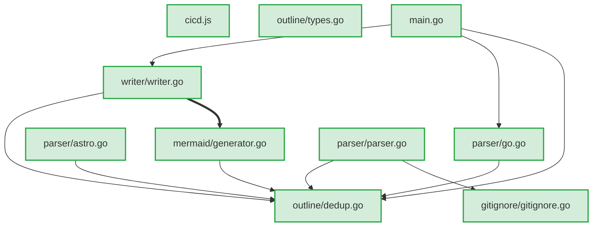
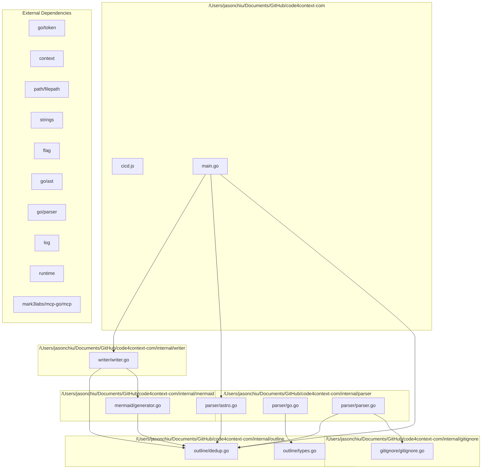

# Code Structure Outline

This file provides an overview of available functions, types, and variables per file for LLM context.

## File Dependency Graph (LLM Context)

This diagram shows direct file-to-file dependencies to help understand which files are related and may need coordinated changes.

## Architecture Overview (Human Context)

This diagram provides a high-level view of the codebase structure with directory groupings and external dependencies.

## AI Agent Guidelines

### Safe to modify:
- Add new functions to existing files
- Modify function implementations (check dependents first)
- Add new types that don't break existing interfaces

### Requires careful analysis:
- Changing function signatures (check all callers)
- Modifying type definitions (check all usage)
- Adding new dependencies (check for circular deps)

### High-risk changes:
- Modifying core types: FileInfo, Outline, error, outline
- Changing package structure
- Removing public APIs

## Change Impact Analysis

## Public API Surface

These are the public functions and types that can be safely used by other files:

### /Users/jasonchiu/Documents/GitHub/code4context-com/internal/gitignore/gitignore.go
- New
- type:Gitignore
- type:Pattern

### /Users/jasonchiu/Documents/GitHub/code4context-com/internal/mermaid/generator.go
- GenerateArchitectureOverview
- GenerateFileDependencyGraph

### /Users/jasonchiu/Documents/GitHub/code4context-com/internal/outline/types.go
- New
- type:FileInfo
- type:FunctionInfo
- type:ImpactInfo
- type:Outline
- type:TestInfo
- type:TypeInfo

### /Users/jasonchiu/Documents/GitHub/code4context-com/internal/parser/parser.go
- ProcessFiles

### /Users/jasonchiu/Documents/GitHub/code4context-com/internal/writer/writer.go
- WriteOutlineToFile
- WriteOutlineToFileWithPath

## Reverse Dependencies

Files that depend on each file (useful for understanding change impact):

### internal/gitignore is used by:
- /Users/jasonchiu/Documents/GitHub/code4context-com/internal/parser/parser.go

### internal/mermaid is used by:
- /Users/jasonchiu/Documents/GitHub/code4context-com/internal/writer/writer.go

### internal/outline is used by:
- /Users/jasonchiu/Documents/GitHub/code4context-com/internal/mermaid/generator.go
- /Users/jasonchiu/Documents/GitHub/code4context-com/internal/parser/astro.go
- /Users/jasonchiu/Documents/GitHub/code4context-com/internal/parser/go.go
- /Users/jasonchiu/Documents/GitHub/code4context-com/internal/parser/parser.go
- /Users/jasonchiu/Documents/GitHub/code4context-com/internal/writer/writer.go
- /Users/jasonchiu/Documents/GitHub/code4context-com/main.go

### internal/parser is used by:
- /Users/jasonchiu/Documents/GitHub/code4context-com/main.go

### internal/writer is used by:
- /Users/jasonchiu/Documents/GitHub/code4context-com/main.go

## /Users/jasonchiu/Documents/GitHub/code4context-com/cicd.js

### Functions
- bold(text)
- buildCrossPlatform(version = null)
- buildLocal()
- calculateContentHash()
- checkBinaryExists(awsEnv, bucket, endpoint, version, platform)
- checkGitStatus()
- checkGitTagExists(version)
- createBunSpinner(initialText = "", opts = {})
- createGitHubRelease(version, summary, description)
- cyan(text)
- findLatestVersionWithBinary(awsEnv, bucket, endpoint, platform, _ignored = 0)
- generateLdflags(version, buildDate, gitCommit)
- getLatestVersionMetadata(awsEnv, bucket, endpoint)
- gitAdd()
- gitCommit(summary, description)
- gitPush()
- gitTag(version, summary)
- green(text)
- hasGoFileChanges()
- mapColor(name)
- parseLatestChangelogEntry()
- red(text)
- render()
- semverToInts(v)
- showInstallationGuide()
- uploadToR2(version, skipBuild = false, releaseSummary = null, releaseDescription = null)
- yellow(text)

### Types
- IMPORTS: bun, path, fs/promises, util

---

## /Users/jasonchiu/Documents/GitHub/code4context-com/internal/gitignore/gitignore.go

### Functions
- (Gitignore) ShouldIgnore(path string) -> bool
- (Gitignore) loadGitignoreFile(gitignorePath string)
- (Gitignore) loadGitignoreFromPath(path string)
- (Gitignore) loadGitignoreHierarchy(gitRoot string, scanRoot string)
- (Gitignore) matchPattern(path string, pattern string) -> bool
- New(root string) -> *Gitignore
- findGitRoot(startPath string) -> string

### Types
- Gitignore (methods: ShouldIgnore, loadGitignoreHierarchy, loadGitignoreFile, loadGitignoreFromPath, matchPattern) (fields: Patterns, Root, GitRoot, LoadedDirs)
- Pattern (fields: Pattern, BaseDir)

---

## /Users/jasonchiu/Documents/GitHub/code4context-com/internal/mermaid/generator.go

### Functions
- GenerateArchitectureOverview(out *outline.Outline) -> string
- GenerateFileDependencyGraph(out *outline.Outline) -> string
- getArrowStyle(strength string) -> string
- getCleanDepName(dep string) -> string
- getDependencyStrength(out *outline.Outline, from string, to string) -> string
- getNodeStyle(riskLevel string) -> string
- getShortFileName(filePath string) -> string
- isLocalImport(imp string) -> bool

---

## /Users/jasonchiu/Documents/GitHub/code4context-com/internal/outline/dedup.go

### Functions
- (Outline) RemoveDuplicates()

---

## /Users/jasonchiu/Documents/GitHub/code4context-com/internal/outline/types.go

### Functions
- (Outline) AddDependency(from string, to string)
- (Outline) AddFile(path string) -> *FileInfo
- (Outline) AddFunctionCall(caller string, callee string)
- (Outline) AddReverseDependency(to string, from string)
- (Outline) AddTypeUsage(typeName string, usedBy string)
- (Outline) CalculateChangeImpact(filePath string) -> *ImpactInfo
- (Outline) EnsureType(name string) -> *TypeInfo
- (Outline) findIndirectDependents(filePath string, visited map[string]bool, result *[]string)
- New() -> *Outline

### Types
- FileInfo (fields: Path, Functions, Types, Vars, Imports, LocalDeps, ExportedFuncs, ExportedTypes, TestCoverage, RiskLevel)
- FunctionInfo (fields: Name, Params, ReturnType, IsPublic, CallsTo, CalledBy, UsesTypes, LineNumber)
- ImpactInfo (fields: DirectDependents, IndirectDependents, RiskLevel, TestsAffected)
- Outline (methods: RemoveDuplicates, EnsureType, AddFile, AddDependency, AddReverseDependency, AddFunctionCall, AddTypeUsage, CalculateChangeImpact, findIndirectDependents) (fields: Files, Types, Vars, Funcs, Dependencies, FunctionCalls, TypeUsage, ReverseDeps, PublicAPIs, ChangeImpact)
- TestInfo (fields: TestFiles, Coverage, TestScenarios)
- TypeInfo (fields: Name, Fields, Methods, IsPublic, Implements, EmbeddedTypes, UsedBy, LineNumber)

---

## /Users/jasonchiu/Documents/GitHub/code4context-com/internal/parser/astro.go

### Functions
- isCustomComponent(tagName string) -> bool
- parseAstroFile(path string, out *outline.Outline, fileInfo *outline.FileInfo) -> error
- parseAstroTemplate(template string, out *outline.Outline, fileInfo *outline.FileInfo)
- parseParameters(paramsStr string) -> []string
- parseTypeScriptContent(content string, out *outline.Outline, fileInfo *outline.FileInfo) -> error
- parseTypeScriptContentRegex(content string, out *outline.Outline, fileInfo *outline.FileInfo) -> error
- parseTypeScriptFile(path string, out *outline.Outline, fileInfo *outline.FileInfo) -> error
- removeDuplicateStrings(slice []string) -> []string
- splitAstroFile(content string) -> string

---

## /Users/jasonchiu/Documents/GitHub/code4context-com/internal/parser/go.go

### Functions
- extractFunctionInfo(d *ast.FuncDecl) -> outline.FunctionInfo
- extractTypesFromExpr(expr ast.Expr) -> []string
- parseGoFile(path string, out *outline.Outline, fileInfo *outline.FileInfo, fset *token.FileSet) -> error
- receiverType(expr ast.Expr) -> string
- typeToString(expr ast.Expr) -> string

---

## /Users/jasonchiu/Documents/GitHub/code4context-com/internal/parser/parser.go

### Functions
- ProcessFiles(root string, out *outline.Outline) -> error
- processFile(path string, info os.FileInfo, out *outline.Outline, fset *token.FileSet) -> error
- resolveAliasImports(out *outline.Outline) -> error

---

## /Users/jasonchiu/Documents/GitHub/code4context-com/internal/writer/writer.go

### Functions
- WriteOutlineToFile(out *outline.Outline) -> error
- WriteOutlineToFileWithPath(out *outline.Outline, filePath string) -> error
- writeAIAgentGuidance(writer *bufio.Writer, out *outline.Outline)
- writeChangeImpactAnalysis(writer *bufio.Writer, out *outline.Outline)
- writePublicAPISurface(writer *bufio.Writer, out *outline.Outline)
- writeReverseDependencies(writer *bufio.Writer, out *outline.Outline)

---

## /Users/jasonchiu/Documents/GitHub/code4context-com/main.go

### Functions
- addGenerateCodeContextTool(s *server.MCPServer)
- addGetCodeContextTool(s *server.MCPServer)
- generateCodeContext(directoryPath string, outputFile string) -> error
- main()
- runCLIMode(args []string, outputFile string)
- runMCPMode()
- showHelpMessage()

---

