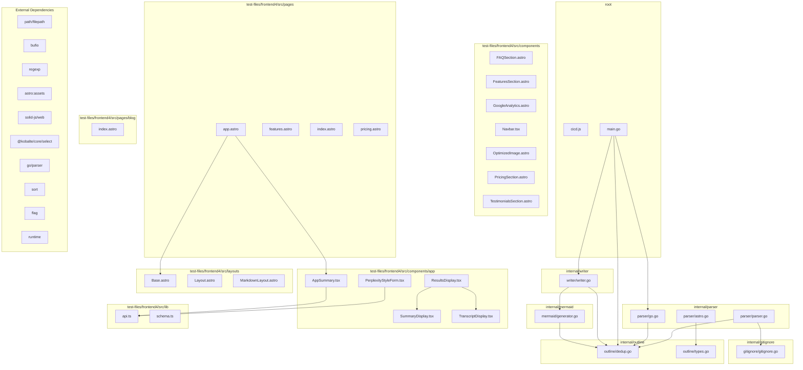

# Code Structure Outline

This file provides an overview of available functions, types, and variables per file for LLM context.

## File Dependency Graph (LLM Context)

This diagram shows direct file-to-file dependencies to help understand which files are related and may need coordinated changes.

```mermaid
graph TD
    F0["cicd.js"]:::lowRisk
    F1["gitignore/gitignore.go"]:::lowRisk
    F2["mermaid/generator.go"]:::lowRisk
    F3["outline/dedup.go"]:::lowRisk
    F4["outline/types.go"]:::lowRisk
    F5["parser/astro.go"]:::lowRisk
    F6["parser/go.go"]:::lowRisk
    F7["parser/parser.go"]:::lowRisk
    F8["writer/writer.go"]:::lowRisk
    F9["main.go"]:::lowRisk
    F10["FAQSection.astro"]:::lowRisk
    F11["FeaturesSection.astro"]:::lowRisk
    F12["GoogleAnalytics.astro"]:::lowRisk
    F13["Navbar.tsx"]:::lowRisk
    F14["OptimizedImage.astro"]:::lowRisk
    F15["PricingSection.astro"]:::lowRisk
    F16["TestimonialsSection.astro"]:::lowRisk
    F17["AppSummary.tsx"]:::lowRisk
    F18["PerplexityStyleForm.tsx"]:::lowRisk
    F19["ResultsDisplay.tsx"]:::lowRisk
    F20["SummaryDisplay.tsx"]:::lowRisk
    F21["TranscriptDisplay.tsx"]:::lowRisk
    F22["Base.astro"]:::lowRisk
    F23["Layout.astro"]:::lowRisk
    F24["MarkdownLayout.astro"]:::lowRisk
    F25["api.ts"]:::mediumRisk
    F26["schema.ts"]:::lowRisk
    F27["app.astro"]:::lowRisk
    F28["index.astro"]:::lowRisk
    F29["features.astro"]:::lowRisk
    F30["index.astro"]:::lowRisk
    F31["pricing.astro"]:::lowRisk

    F2 --> F4
    F5 --> F3
    F6 --> F3
    F7 --> F1
    F7 --> F3
    F8 ==> F2
    F8 --> F3
    F9 --> F3
    F9 --> F6
    F9 --> F8
    F17 --> F25
    F18 --> F25
    F19 --> F21
    F19 --> F20
    F27 --> F22
    F27 --> F17

    classDef highRisk fill:#ffcccc,stroke:#ff0000,stroke-width:2px
    classDef mediumRisk fill:#fff3cd,stroke:#ffc107,stroke-width:2px
    classDef lowRisk fill:#d4edda,stroke:#28a745,stroke-width:2px
```

## Architecture Overview (Human Context)

This diagram provides a high-level view of the codebase structure with directory groupings and external dependencies.

## AI Agent Guidelines

### Safe to modify:
- Add new functions to existing files
- Modify function implementations (check dependents first)
- Add new types that don't break existing interfaces

### Requires careful analysis:
- Changing function signatures (check all callers)
- Modifying type definitions (check all usage)
- Adding new dependencies (check for circular deps)

### High-risk changes:
- Modifying core types: FileInfo, Outline, error, outline
- Changing package structure
- Removing public APIs

## Change Impact Analysis

### Medium-Risk Files:
- **test-files/frontend4/src/lib/api.ts**: 2 direct + 3 indirect dependents

## Public API Surface

These are the public functions and types that can be safely used by other files:

### internal/gitignore/gitignore.go
- New
- type:Gitignore
- type:Pattern

### internal/mermaid/generator.go
- GenerateArchitectureOverview
- GenerateFileDependencyGraph

### internal/outline/types.go
- New
- type:FileInfo
- type:FunctionInfo
- type:ImpactInfo
- type:Outline
- type:TestInfo
- type:TypeInfo

### internal/parser/parser.go
- ProcessFiles

### internal/writer/writer.go
- WriteOutlineToFile
- WriteOutlineToFileWithPath

## Reverse Dependencies

Files that depend on each file (useful for understanding change impact):

### ../../layouts/Base.astro is used by:
- test-files/frontend4/src/pages/blog/index.astro

### ../components/FAQSection.astro is used by:
- test-files/frontend4/src/pages/pricing.astro

### ../components/FeaturesSection.astro is used by:
- test-files/frontend4/src/pages/features.astro

### ../components/GoogleAnalytics.astro is used by:
- test-files/frontend4/src/layouts/Base.astro

### ../components/Navbar.tsx is used by:
- test-files/frontend4/src/layouts/Base.astro

### ../components/PricingSection.astro is used by:
- test-files/frontend4/src/pages/pricing.astro

### ../components/TestimonialsSection.astro is used by:
- test-files/frontend4/src/pages/features.astro
- test-files/frontend4/src/pages/pricing.astro

### ../layouts/Base.astro is used by:
- test-files/frontend4/src/pages/features.astro
- test-files/frontend4/src/pages/index.astro
- test-files/frontend4/src/pages/pricing.astro

### ./Base.astro is used by:
- test-files/frontend4/src/layouts/MarkdownLayout.astro

### ./api is used by:
- test-files/frontend4/src/lib/schema.ts

### ./schema is used by:
- test-files/frontend4/src/lib/api.ts

### internal/gitignore is used by:
- internal/parser/parser.go

### internal/mermaid is used by:
- internal/writer/writer.go

### internal/outline is used by:
- internal/mermaid/generator.go
- internal/parser/astro.go
- internal/parser/go.go
- internal/parser/parser.go
- internal/writer/writer.go
- main.go

### internal/parser is used by:
- main.go

### internal/writer is used by:
- main.go

### test-files/frontend4/src/components/app/AppSummary.tsx is used by:
- test-files/frontend4/src/pages/app.astro

### test-files/frontend4/src/components/app/SummaryDisplay.tsx is used by:
- test-files/frontend4/src/components/app/ResultsDisplay.tsx

### test-files/frontend4/src/components/app/TranscriptDisplay.tsx is used by:
- test-files/frontend4/src/components/app/ResultsDisplay.tsx

### test-files/frontend4/src/layouts/Base.astro is used by:
- test-files/frontend4/src/pages/app.astro

### test-files/frontend4/src/lib/api.ts is used by:
- test-files/frontend4/src/components/app/AppSummary.tsx
- test-files/frontend4/src/components/app/PerplexityStyleForm.tsx

### ~/components/app/AppSummary.tsx is used by:
- test-files/frontend4/src/pages/app.astro

### ~/components/app/SummaryDisplay is used by:
- test-files/frontend4/src/components/app/ResultsDisplay.tsx

### ~/components/app/TranscriptDisplay is used by:
- test-files/frontend4/src/components/app/ResultsDisplay.tsx

### ~/layouts/Base.astro is used by:
- test-files/frontend4/src/pages/app.astro

### ~/lib/api is used by:
- test-files/frontend4/src/components/app/AppSummary.tsx
- test-files/frontend4/src/components/app/PerplexityStyleForm.tsx

### ~icons/carbon/ai-recommend is used by:
- test-files/frontend4/src/components/app/PerplexityStyleForm.tsx

### ~icons/carbon/checkmark is used by:
- test-files/frontend4/src/components/app/PerplexityStyleForm.tsx

### ~icons/carbon/close is used by:
- test-files/frontend4/src/components/app/AppSummary.tsx
- test-files/frontend4/src/components/app/PerplexityStyleForm.tsx
- test-files/frontend4/src/components/app/ResultsDisplay.tsx

### ~icons/carbon/copy-file is used by:
- test-files/frontend4/src/components/app/PerplexityStyleForm.tsx

### ~icons/carbon/send is used by:
- test-files/frontend4/src/components/app/PerplexityStyleForm.tsx

### ~icons/carbon/text-wrap is used by:
- test-files/frontend4/src/components/app/PerplexityStyleForm.tsx

## cicd.js

### Functions
- bold(text)
- buildCrossPlatform(version = null)
- buildLocal()
- calculateContentHash()
- checkBinaryExists(awsEnv, bucket, endpoint, version, platform)
- checkGitStatus()
- checkGitTagExists(version)
- createBunSpinner(initialText = "", opts = {})
- createGitHubRelease(version, summary, description)
- cyan(text)
- findLatestVersionWithBinary(awsEnv, bucket, endpoint, platform, _ignored = 0)
- generateLdflags(version, buildDate, gitCommit)
- getLatestVersionMetadata(awsEnv, bucket, endpoint)
- gitAdd()
- gitCommit(summary, description)
- gitPush()
- gitTag(version, summary)
- green(text)
- hasGoFileChanges()
- mapColor(name)
- parseLatestChangelogEntry()
- red(text)
- render()
- semverToInts(v)
- showInstallationGuide()
- uploadToR2(version, skipBuild = false, releaseSummary = null, releaseDescription = null)
- yellow(text)

### Types
- IMPORTS: bun, path, fs/promises, util

---

## internal/gitignore/gitignore.go

### Functions
- (Gitignore) ShouldIgnore(path string) -> bool
- (Gitignore) loadGitignoreFile(gitignorePath string)
- (Gitignore) loadGitignoreFromPath(path string)
- (Gitignore) loadGitignoreHierarchy(gitRoot string, scanRoot string)
- (Gitignore) matchPattern(path string, pattern string) -> bool
- New(root string) -> *Gitignore
- findGitRoot(startPath string) -> string

### Types
- Gitignore (methods: ShouldIgnore, loadGitignoreHierarchy, loadGitignoreFile, loadGitignoreFromPath, matchPattern) (fields: Patterns, Root, GitRoot, LoadedDirs)
- Pattern (fields: Pattern, BaseDir)

---

## internal/mermaid/generator.go

### Functions
- GenerateArchitectureOverview(out *outline.Outline) -> string
- GenerateFileDependencyGraph(out *outline.Outline) -> string
- getArrowStyle(strength string) -> string
- getCleanDepName(dep string) -> string
- getDependencyStrength(out *outline.Outline, from string, to string) -> string
- getNodeStyle(riskLevel string) -> string
- getShortFileName(filePath string) -> string
- isLocalImport(imp string) -> bool

---

## internal/outline/dedup.go

### Functions
- (Outline) RemoveDuplicates()

---

## internal/outline/types.go

### Functions
- (Outline) AddDependency(from string, to string)
- (Outline) AddFile(path string) -> *FileInfo
- (Outline) AddFunctionCall(caller string, callee string)
- (Outline) AddReverseDependency(to string, from string)
- (Outline) AddTypeUsage(typeName string, usedBy string)
- (Outline) CalculateChangeImpact(filePath string) -> *ImpactInfo
- (Outline) EnsureType(name string) -> *TypeInfo
- (Outline) findIndirectDependents(filePath string, visited map[string]bool, result *[]string)
- New() -> *Outline

### Types
- FileInfo (fields: Path, Functions, Types, Vars, Imports, LocalDeps, ExportedFuncs, ExportedTypes, TestCoverage, RiskLevel)
- FunctionInfo (fields: Name, Params, ReturnType, IsPublic, CallsTo, CalledBy, UsesTypes, LineNumber)
- ImpactInfo (fields: DirectDependents, IndirectDependents, RiskLevel, TestsAffected)
- Outline (methods: RemoveDuplicates, EnsureType, AddFile, AddDependency, AddReverseDependency, AddFunctionCall, AddTypeUsage, CalculateChangeImpact, findIndirectDependents) (fields: Files, Types, Vars, Funcs, Dependencies, FunctionCalls, TypeUsage, ReverseDeps, PublicAPIs, ChangeImpact)
- TestInfo (fields: TestFiles, Coverage, TestScenarios)
- TypeInfo (fields: Name, Fields, Methods, IsPublic, Implements, EmbeddedTypes, UsedBy, LineNumber)

---

## internal/parser/astro.go

### Functions
- isCustomComponent(tagName string) -> bool
- parseAstroFile(path string, out *outline.Outline, fileInfo *outline.FileInfo) -> error
- parseAstroTemplate(template string, out *outline.Outline, fileInfo *outline.FileInfo)
- parseParameters(paramsStr string) -> []string
- parseTypeScriptContent(content string, out *outline.Outline, fileInfo *outline.FileInfo) -> error
- parseTypeScriptContentRegex(content string, out *outline.Outline, fileInfo *outline.FileInfo) -> error
- parseTypeScriptFile(path string, out *outline.Outline, fileInfo *outline.FileInfo) -> error
- removeDuplicateStrings(slice []string) -> []string
- splitAstroFile(content string) -> string

---

## internal/parser/go.go

### Functions
- extractFunctionInfo(d *ast.FuncDecl) -> outline.FunctionInfo
- extractTypesFromExpr(expr ast.Expr) -> []string
- parseGoFile(path string, out *outline.Outline, fileInfo *outline.FileInfo, fset *token.FileSet) -> error
- receiverType(expr ast.Expr) -> string
- typeToString(expr ast.Expr) -> string

---

## internal/parser/parser.go

### Functions
- ProcessFiles(root string, out *outline.Outline) -> error
- processFile(path string, info os.FileInfo, out *outline.Outline, fset *token.FileSet) -> error
- resolveAliasImports(out *outline.Outline) -> error

---

## internal/writer/writer.go

### Functions
- WriteOutlineToFile(out *outline.Outline) -> error
- WriteOutlineToFileWithPath(out *outline.Outline, filePath string) -> error
- writeAIAgentGuidance(writer *bufio.Writer, out *outline.Outline)
- writeChangeImpactAnalysis(writer *bufio.Writer, out *outline.Outline)
- writePublicAPISurface(writer *bufio.Writer, out *outline.Outline)
- writeReverseDependencies(writer *bufio.Writer, out *outline.Outline)

---

## main.go

### Functions
- addGenerateCodeContextTool(s *server.MCPServer)
- addGetCodeContextTool(s *server.MCPServer)
- generateCodeContext(directoryPath string, outputFile string) -> error
- main()
- runCLIMode(args []string, outputFile string)
- runMCPMode()
- showHelpMessage()

---

## test-files/frontend4/src/components/FAQSection.astro

### Types
- FAQ (fields: question: string, answer: string)
- faqs: FAQ[]

---

## test-files/frontend4/src/components/FeaturesSection.astro

### Types
- Feature (fields: title: string, description: string, icon: string)
- features: Feature[]

---

## test-files/frontend4/src/components/GoogleAnalytics.astro

### Types
- EXPORTS: Props

---

## test-files/frontend4/src/components/Navbar.tsx

### Functions
- Navbar()
- closeMenu()
- toggleMenu()

### Types
- EXPORTS: Navbar
- IMPORTS: solid-js
- NavLinkItem (fields: href: string, label: string)
- navLinks: NavLinkItem[]

---

## test-files/frontend4/src/components/OptimizedImage.astro

### Types
- COMPONENTS: Picture
- IMPORTS: astro:assets

---

## test-files/frontend4/src/components/PricingSection.astro

### Types
- PricingTier (fields: name: string, price: string, period: string, description: string, features: string[], popular?: boolean, cta: string, ctaHref: string)
- pricingTiers: PricingTier[]

---

## test-files/frontend4/src/components/TestimonialsSection.astro

### Types
- Testimonial (fields: name: string, role: string, company?: string, content: string, avatar: string, rating: number)
- testimonials: Testimonial[]

---

## test-files/frontend4/src/components/app/AppSummary.tsx

### Functions
- AppSummary()
- handleActionComplete(result?: { transcript?: EnhancedTranscriptResponse | null, summary?: string })
- handleActionError(error: string)
- handleActionTrigger(actionType: 'transcript' | 'summarize', triggerSource: 'auto' | 'user' = 'user')

### Types
- AppSummary: Component
- CompletedParams (fields: videoId: string, language: Language, provider?: LLMProvider, model?: LLMModel, actionType: 'transcript' | 'summarize', value: opt.value, label: opt.label, if(import.meta.env.DEBUG), if(isActionInProgress(), if(import.meta.env.DEBUG), setFormError(null), if(isActionInProgress(), if(import.meta.env.DEBUG), if(isActionInProgress(), if(import.meta.env.DEBUG), if(import.meta.env.DEBUG), if(!validationResult), if(import.meta.env.DEBUG), setFormError(validationErrorMsg), if(!providerModelValue), if(import.meta.env.DEBUG), if(providerModelValue === 'auto'), if(parsed && parsed.provider === 'auto' && parsed.model === 'auto'), if(import.meta.env.DEBUG), setIsActionInProgress(false), setIsFetchingTranscriptOnly(false), setIsStartingStream(false), if(parsed && parsed.provider && parsed.provider !== 'auto' && parsed.model !== undefined), setFormError(parseErrorMsg), setIsActionInProgress(false), setIsFetchingTranscriptOnly(false), setIsStartingStream(false), if(!videoId || !language), setFormError(missingParamsMsg), if(currentParams), if(actionType === 'transcript'), if(isSameVideoAndLang && (currentParams.actionType === 'transcript' || currentParams.actionType === 'summarize'), if(import.meta.env.DEBUG), queueMicrotask((), if(transcriptElement), if(import.meta.env.DEBUG), if(isSameVideoAndLang && isSameProvider && isSameModel && currentParams.actionType === 'summarize'), if(import.meta.env.DEBUG), queueMicrotask((), if(summaryElement), if(import.meta.env.DEBUG), if(transcriptElement), if(isSameVideoAndLang && (currentParams.actionType === 'transcript' || currentParams.actionType === 'summarize'), if(import.meta.env.DEBUG), if(import.meta.env.DEBUG), setIsActionInProgress(true), if(actionType === 'transcript'), setIsFetchingTranscriptOnly(true), setIsStartingStream(true), videoId: videoId!, language: language!, provider: provider!, model: model, skipTranscript: skipTranscriptFetch, if(import.meta.env.DEBUG), if(result?.transcript), setTranscriptResult(result.transcript), if(result?.summary != null), setSummaryText(result.summary), if(completedAction), videoId: completedAction.videoId, language: completedAction.language, provider: completedAction.provider, model: completedAction.model, actionType: completedAction.actionType, if(import.meta.env.DEBUG), if(completedActionType === 'transcript'), queueMicrotask((), if(transcriptElement), if(import.meta.env.DEBUG), if(import.meta.env.DEBUG), queueMicrotask((), if(summaryElement), if(import.meta.env.DEBUG), if(transcriptElement), if(import.meta.env.DEBUG), setIsActionInProgress(false), setIsFetchingTranscriptOnly(false), setIsStartingStream(false), setIsStreamingActive(false), setSummaryText(''), setIsActionInProgress(false), setIsFetchingTranscriptOnly(false), setIsStartingStream(false), setIsStreamingActive(false), createEffect((), if(currentVideoId && currentVideoId !== lastVideoId), if(import.meta.env.DEBUG), setLastCompletedParams(null), setActionParams(null), if(import.meta.env.DEBUG), setLastCompletedParams(null), setActionParams(null), formStore: transcriptionForm, Form: Form, Field: Field, providerModelOptions: providerModelOptions, isDisabled: isActionInProgress, onTriggerAction: handleActionTrigger, validateForm: () => validate(transcriptionForm), setFormValue: <T extends keyof TranscriptionFormType>(, fieldName: T, value: Maybe<TranscriptionFormType[T]>, if(value === undefined || value === null), if(fieldName === 'language'), setValue(transcriptionForm, 'language', 'en'), setValue(transcriptionForm, 'providerModel', DEFAULT_PROVIDER_MODEL), setValue(transcriptionForm, '_stream', false), setValue(transcriptionForm, 'url', ''), setValue(transcriptionForm, fieldName, value as any), getFormValue: <T extends keyof TranscriptionFormType>(, fieldName: T, transcriptResult: [transcriptResult, summaryText: [summaryText, chunkSize: [chunkSize)
- IMPORTS: solid-js, solid-js/web, @modular-forms/solid, @kobalte/core/toast, ~icons/carbon/close, ~/lib/api
- SelectOption (fields: value: string, label: string, disabled?: boolean, value: string, label: string, disabled?: boolean)
- perplexityFormProps: PerplexityStyleFormProps
- providerModelOptions: SelectOption[]

---

## test-files/frontend4/src/components/app/PerplexityStyleForm.tsx

### Functions
- PerplexityStyleForm(props)
- copySummary()
- copyTranscript()
- copyTranscriptWithMetadata()
- downloadTranscriptJson()
- findOption(options: SelectOption[], value: string | number | undefined) -> SelectOption | undefined
- formatDisplayDate(dateString: string | undefined) -> string | null
- formatTime(seconds: number) -> string

### Types
- EXPORTS: PerplexityStyleFormProps, PerplexityStyleForm
- FieldName (fields: = keyof T)
- IMPORTS: solid-js, @kobalte/core/text-field, @kobalte/core/toggle-button, @kobalte/core/select, @kobalte/core/button, @kobalte/core/dropdown-menu, @kobalte/core/tooltip, @kobalte/core/toast, @solid-primitives/media, ~icons/carbon/ai-recommend, ~icons/carbon/copy-file, ~icons/carbon/checkmark, ~icons/carbon/close, ~icons/carbon/send, ~icons/carbon/text-wrap, ~/lib/api
- SelectOption (fields: value: string, label: string, disabled?: boolean, value: string, label: string, disabled?: boolean)
- SpecificField (fields: = ReturnType<typeof createForm<TranscriptionFormType>>[1]['Field'])
- SpecificForm (fields: = ReturnType<typeof createForm<TranscriptionFormType>>[1]['Form'])
- chunkSizeOptions: SelectOption[]
- metadataLines: string[]

---

## test-files/frontend4/src/components/app/ResultsDisplay.tsx

### Functions
- ResultsDisplay(props)
- resetInternalState(preserveTranscript: boolean = false)

### Types
- EXPORTS: ResultsDisplayProps, ResultsDisplay
- IMPORTS: solid-js, marked, isomorphic-dompurify, @kobalte/core/toast, @solid-primitives/resize-observer, @solid-primitives/media, ~icons/carbon/close, ~/components/app/TranscriptDisplay, ~/components/app/SummaryDisplay
- metadataUpdate: Partial<SummaryResponse>

---

## test-files/frontend4/src/components/app/SummaryDisplay.tsx

### Functions
- SummaryDisplay(props)

### Types
- EXPORTS: SummaryDisplay
- IMPORTS: solid-js
- SummaryDisplayProps (fields: renderedHtml: string, isStreaming: boolean, isLoading: boolean, metadata: Partial<SummaryResponse> | null, debug?: boolean)

---

## test-files/frontend4/src/components/app/TranscriptDisplay.tsx

### Functions
- TranscriptDisplay(props)
- calculateEndTime(start: number, duration: number) -> number
- formatDisplayDate(dateString: string | undefined) -> string | null
- formatTime(seconds: number) -> string
- scrubLinks(text: string | null | undefined) -> string

### Types
- ChunkedEntry (fields: start: number, duration: number, text: string, entries: TranscriptEntry[])
- EXPORTS: TranscriptDisplay
- IMPORTS: solid-js
- NormalizedEntry (fields: start: number, duration: number, text: string)
- TranscriptDisplayProps (fields: transcript: EnhancedTranscriptResponse | null, chunkSize: () => number)
- chunks: ChunkedEntry[]

---

## test-files/frontend4/src/layouts/Base.astro

### Types
- COMPONENTS: GoogleAnalytics, Navbar
- IMPORTS: ../components/Navbar.tsx, ../components/GoogleAnalytics.astro

---

## test-files/frontend4/src/layouts/Layout.astro

---

## test-files/frontend4/src/layouts/MarkdownLayout.astro

### Types
- COMPONENTS: Base
- EXPORTS: Props
- IMPORTS: ./Base.astro

---

## test-files/frontend4/src/lib/api.ts

### Functions
- extractVideoId(input: string) -> string | null
- fetchData()
- getApiBaseUrl() -> string

### Types
- EXPORTS: getApiBaseUrl, extractVideoId, TranscriptEntry, EnhancedTranscriptResponse, SummaryResponse, TranscriptSummarizeResponse, streamTranscriptAndSummary, FetchEventSourceController, streamSummaryOnly
- IMPORTS: ./schema
- StreamSummaryRequestBody (fields: videoId: string, language: Language, transcript: string, title: string, description: string, provider?: LLMProvider, model?: LLMModel)
- listeners: { [type: string]: ((event: MessageEvent)
- requestBody: StreamSummaryRequestBody

---

## test-files/frontend4/src/lib/schema.ts

### Functions
- getLanguageDisplayName(code: Language) -> string
- getModelDisplayName(code: LLMModel) -> string
- getProviderDisplayName(code: LLMProvider) -> string
- parseProviderModel(value: string | undefined | null)
- validateYoutubeUrl(url: string)

### Types
- EXPORTS: youtubeUrlStringSchema, youtubeUrlSchema, validateYoutubeUrl, languageSchema, Language, languageDisplayNames, getLanguageDisplayName, llmProviderSchema, LLMProvider, providerDisplayNames, getProviderDisplayName, llmModelSchema, LLMModel, modelDisplayNames, getModelDisplayName, ProviderModelOption, allProviderModelOptions, providerModelSchema, ProviderModelValue, parseProviderModel, TranscriptionFormSchema, TranscriptionFormType
- IMPORTS: valibot, ./api

---

## test-files/frontend4/src/pages/app.astro

### Types
- COMPONENTS: Base, AppSummary
- IMPORTS: ~/layouts/Base.astro, ~/components/app/AppSummary.tsx

---

## test-files/frontend4/src/pages/blog/index.astro

### Types
- COMPONENTS: Base
- IMPORTS: ../../layouts/Base.astro

---

## test-files/frontend4/src/pages/features.astro

### Types
- COMPONENTS: Base, FeaturesSection, TestimonialsSection
- IMPORTS: ../layouts/Base.astro, ../components/FeaturesSection.astro, ../components/TestimonialsSection.astro

---

## test-files/frontend4/src/pages/index.astro

### Types
- COMPONENTS: Base
- IMPORTS: ../layouts/Base.astro

---

## test-files/frontend4/src/pages/pricing.astro

### Types
- COMPONENTS: Base, PricingSection, TestimonialsSection, FAQSection
- IMPORTS: ../layouts/Base.astro, ../components/PricingSection.astro, ../components/FAQSection.astro, ../components/TestimonialsSection.astro

---

