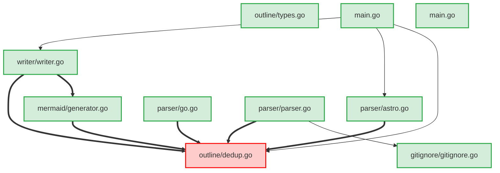
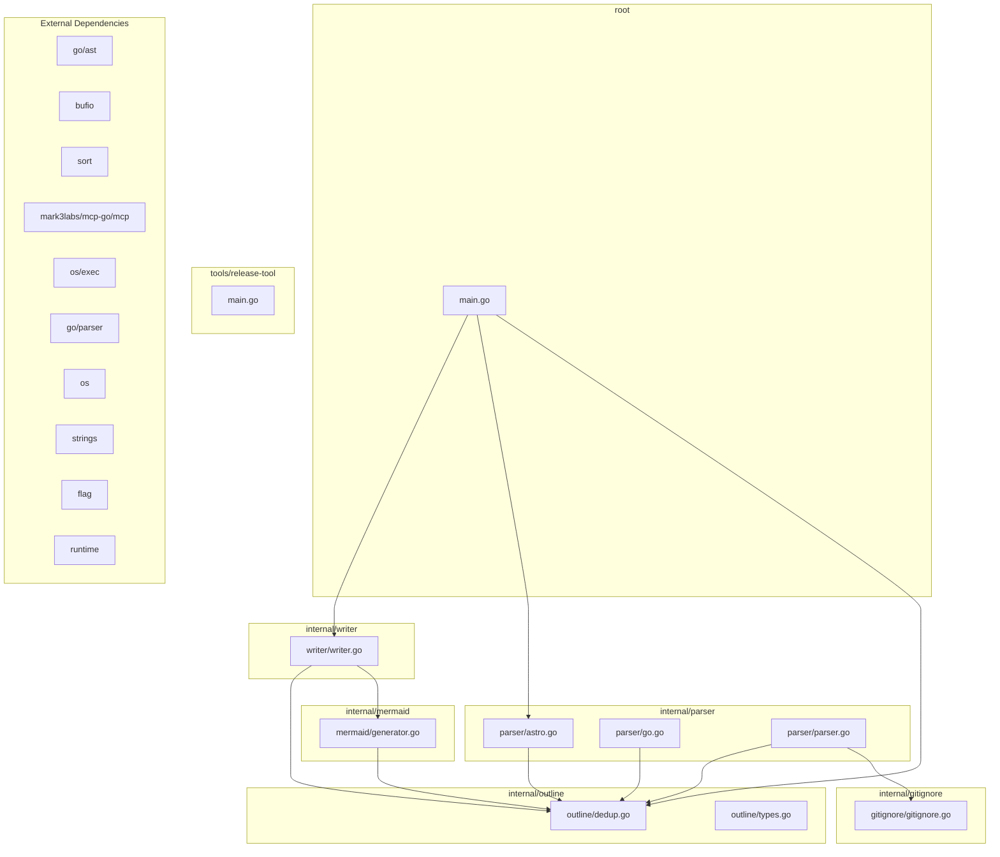

# Code Structure Outline

This file provides an overview of available functions and types per file for LLM context.

## File Dependency Graph (LLM Context)

This diagram shows direct file-to-file dependencies to help understand which files are related and may need coordinated changes.

## Go Package Dependency Graph (LLM Context)

This diagram shows Go package-to-package dependencies (directory-based), with edges weighted by imports, cross-package calls, and cross-package type usage.

## Architecture Overview (Human Context)

This diagram provides a high-level view of the codebase structure with directory groupings and external dependencies.

## AI Agent Guidelines

### Safe to modify:
- Add new functions to existing files
- Modify function implementations (check dependents first)
- Add new types that don't break existing interfaces

### Requires careful analysis:
- Changing function signatures (check all callers)
- Modifying type definitions (check all usage)
- Adding new dependencies (check for circular deps)

### High-risk changes:
- Modifying core types: FileInfo, Outline, ast, error, outline
- Changing package structure
- Removing public APIs

## Change Impact Analysis

### High-Risk Files (many dependents):
- **internal/outline/dedup.go**: 6 direct + 6 indirect dependents

### Go Package Risk (directory-level):
#### Medium-Risk Packages:
- **internal/outline**: 4 direct + 4 indirect dependent packages

## Public API Surface

These are the public functions and types that can be safely used by other files:

### internal/gitignore/gitignore.go
- New
- type:Gitignore
- type:Pattern

### internal/mermaid/generator.go
- GenerateArchitectureOverview
- GenerateFileDependencyGraph
- GenerateGoPackageDependencyGraph

### internal/outline/types.go
- New
- type:EdgeStat
- type:FileInfo
- type:FunctionInfo
- type:ImpactInfo
- type:Outline
- type:PackageInfo
- type:TestInfo
- type:TypeInfo

### internal/parser/parser.go
- ProcessFiles

### internal/writer/writer.go
- WriteOutlineToFile
- WriteOutlineToFileWithPath

### tools/release-tool/main.go
- type:ChangelogEntry

## Reverse Dependencies

Files that depend on each file (useful for understanding change impact):

### internal/gitignore/gitignore.go is used by:
- internal/parser/parser.go

### internal/mermaid/generator.go is used by:
- internal/writer/writer.go

### internal/outline/dedup.go is used by:
- internal/mermaid/generator.go
- internal/parser/astro.go
- internal/parser/go.go
- internal/parser/parser.go
- internal/writer/writer.go
- main.go

### internal/parser/astro.go is used by:
- main.go

### internal/writer/writer.go is used by:
- main.go

## internal/gitignore/gitignore.go

### Functions
- (Gitignore) ShouldIgnore(path string) -> bool
- (Gitignore) loadGitignoreFile(gitignorePath string)
- (Gitignore) loadGitignoreFromPath(path string)
- (Gitignore) loadGitignoreHierarchy(gitRoot string, scanRoot string)
- (Gitignore) matchPattern(path string, pattern string) -> bool
- New(root string) -> *Gitignore
- findGitRoot(startPath string) -> string

### Types
- Gitignore (methods: ShouldIgnore, loadGitignoreHierarchy, loadGitignoreFile, loadGitignoreFromPath, matchPattern) (fields: Patterns, Root, GitRoot, LoadedDirs)
- Pattern (fields: Pattern, BaseDir)

---

## internal/mermaid/generator.go

### Functions
- GenerateArchitectureOverview(out *outline.Outline) -> string
- GenerateFileDependencyGraph(out *outline.Outline) -> string
- GenerateGoPackageDependencyGraph(out *outline.Outline) -> string
- collectGoPackages(out *outline.Outline) -> []string
- getArrowStyle(strength string) -> string
- getCleanDepName(dep string) -> string
- getDependencyStrength(out *outline.Outline, from string, to string) -> string
- getNodeStyle(riskLevel string) -> string
- getPackageDependencyStrength(out *outline.Outline, fromPkg string, toPkg string) -> string
- getShortFileName(filePath string) -> string
- isLocalImport(imp string, modulePath string) -> bool

---

## internal/outline/dedup.go

### Functions
- (Outline) RemoveDuplicates()

---

## internal/outline/types.go

### Functions
- (Outline) AddDependency(from string, to string)
- (Outline) AddFile(path string, absPath string) -> *FileInfo
- (Outline) AddFunctionCall(caller string, callee string)
- (Outline) AddPackageDependency(fromPkg string, toPkg string)
- (Outline) AddPackageEdgeStat(fromPkg string, toPkg string, stat EdgeStat)
- (Outline) AddPackageReverseDependency(toPkg string, fromPkg string)
- (Outline) AddReverseDependency(to string, from string)
- (Outline) AddTypeUsage(typeName string, usedBy string)
- (Outline) CalculateChangeImpact(filePath string) -> *ImpactInfo
- (Outline) CalculatePackageChangeImpact(packagePath string) -> *ImpactInfo
- (Outline) EnsureType(name string) -> *TypeInfo
- (Outline) findIndirectDependents(filePath string, visited map[string]bool, result *[]string)
- (Outline) findIndirectPackageDependents(packagePath string, visited map[string]bool, result *[]string)
- New() -> *Outline

### Types
- EdgeStat (fields: Imports, Calls, TypeUses)
- FileInfo (fields: Path, AbsPath, PackageDir, PackageName, Functions, Types, Vars, Imports, LocalDeps, LocalPkgDeps, ExportedFuncs, ExportedTypes, TestCoverage, RiskLevel)
- FunctionInfo (fields: Name, Params, ReturnType, IsPublic, CallsTo, CalledBy, UsesTypes, LineNumber)
- ImpactInfo (fields: DirectDependents, IndirectDependents, RiskLevel, TestsAffected)
- Outline (methods: RemoveDuplicates, EnsureType, AddFile, AddDependency, AddPackageDependency, AddPackageReverseDependency, AddPackageEdgeStat, CalculatePackageChangeImpact, findIndirectPackageDependents, AddReverseDependency, AddFunctionCall, AddTypeUsage, CalculateChangeImpact, findIndirectDependents) (fields: RootDir, ModulePath, Files, Types, Vars, Funcs, Dependencies, FunctionCalls, TypeUsage, ReverseDeps, PublicAPIs, ChangeImpact, Packages, PackageDeps, PackageReverseDeps, PackageImpact, PackageEdgeStats)
- PackageInfo (fields: PackagePath, Files, Representative)
- TestInfo (fields: TestFiles, Coverage, TestScenarios)
- TypeInfo (fields: Name, Fields, Methods, IsPublic, Implements, EmbeddedTypes, UsedBy, LineNumber)

---

## internal/parser/astro.go

### Functions
- isCustomComponent(tagName string) -> bool
- parseAstroFile(path string, out *outline.Outline, fileInfo *outline.FileInfo) -> error
- parseAstroTemplate(template string, out *outline.Outline, fileInfo *outline.FileInfo)
- parseParameters(paramsStr string) -> []string
- parseTypeScriptContent(content string, out *outline.Outline, fileInfo *outline.FileInfo) -> error
- parseTypeScriptContentRegex(content string, out *outline.Outline, fileInfo *outline.FileInfo) -> error
- parseTypeScriptFile(path string, out *outline.Outline, fileInfo *outline.FileInfo) -> error
- removeDuplicateStrings(slice []string) -> []string
- splitAstroFile(content string) -> string

---

## internal/parser/go.go

### Functions
- extractFunctionInfo(d *ast.FuncDecl) -> outline.FunctionInfo
- extractTypesFromExpr(expr ast.Expr) -> []string
- localPkgsUsedInTypeExpr(expr ast.Expr, aliasToLocalPkgDir map[string]string) -> []string
- parseGoFile(path string, out *outline.Outline, fileInfo *outline.FileInfo, fset *token.FileSet) -> error
- receiverType(expr ast.Expr) -> string
- recordGoCouplingSignals(d *ast.FuncDecl, fileInfo *outline.FileInfo, out *outline.Outline, aliasToLocalPkgDir map[string]string)
- typeToString(expr ast.Expr) -> string

---

## internal/parser/parser.go

### Functions
- ProcessFiles(root string, out *outline.Outline) -> error
- buildPackageIndexAndResolveGoDeps(out *outline.Outline)
- findGoModulePath(startAbs string) -> string
- hasKnownFrontendExtension(path string) -> bool
- processFile(path string, info os.FileInfo, out *outline.Outline, fset *token.FileSet, absRoot string) -> error
- resolveAliasImports(out *outline.Outline) -> error
- resolveLocalImport(fromFile string, dep string, out *outline.Outline) -> string
- toRepoRelativePath(absRoot string, absPath string) -> string

---

## internal/writer/writer.go

### Functions
- WriteOutlineToFile(out *outline.Outline) -> error
- WriteOutlineToFileWithPath(out *outline.Outline, filePath string) -> error
- writeAIAgentGuidance(writer *bufio.Writer, out *outline.Outline)
- writeChangeImpactAnalysis(writer *bufio.Writer, out *outline.Outline)
- writePublicAPISurface(writer *bufio.Writer, out *outline.Outline)
- writeReverseDependencies(writer *bufio.Writer, out *outline.Outline)

---

## main.go

### Functions
- addGenerateCodeContextTool(s *server.MCPServer)
- addGetCodeContextTool(s *server.MCPServer)
- generateCodeContext(directoryPath string, outputFile string) -> error
- main()
- runCLIMode(args []string, outputFile string)
- runMCPMode()
- showHelpMessage()

---

## tools/release-tool/main.go

### Functions
- ensureGitRepo() -> error
- ensureOriginRemote() -> error
- ensureTagAbsent(version string) -> error
- fetchTags() -> error
- gitAddAll() -> error
- gitCommitIfNeeded(summary string, description string) -> bool, error
- gitPush(tag string) -> error
- gitTag(version string, summary string, description string) -> string, error
- main()
- parseLatestChangelogEntry() -> *ChangelogEntry, error
- printUsage()
- releaseCommand() -> error
- versionCommand() -> error

### Types
- ChangelogEntry (fields: Version, Summary, Description)

---

